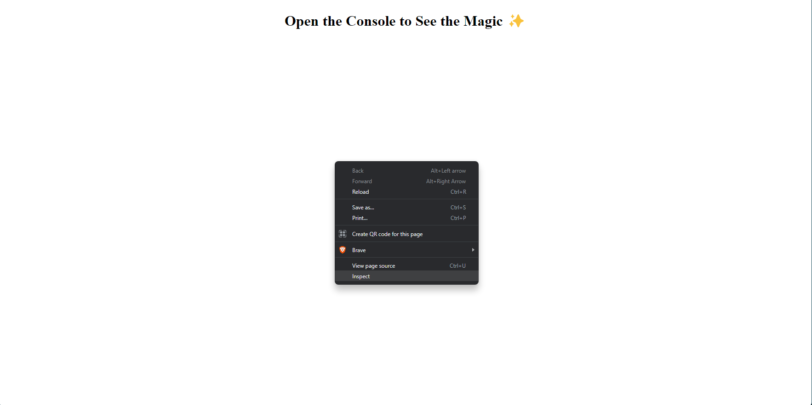
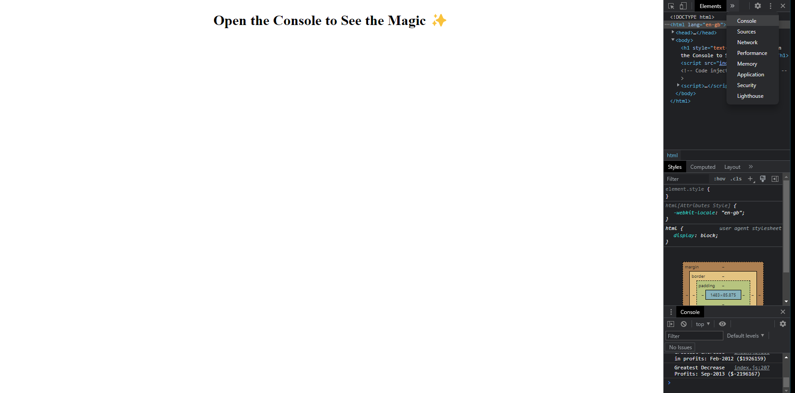
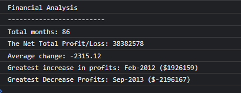
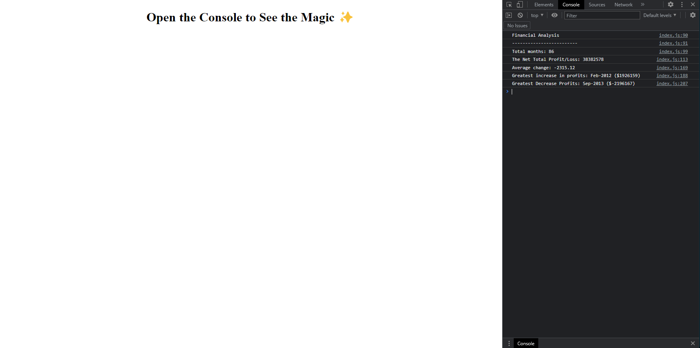

# Console-Finances

## Description

This repo utilizes the concepts learned in Javascript to address a real-world example. The task was to create code for analyzing the financial records of a company from a financial dataset which was provided. 

Skills used included psuedocoding and Javascript fundamentals, such as variables, for loops, math, multidimensional arrays and conditional logic.

## Issues

I had difficulty completing the analysis by operating directly with the 2D array, so I used the lengthy approach of extracting the data into a two separate arrays, performing the required operations on the single array, then querying indices of each new array to realign and retrieve the values required. This was due to my limited knowledge and inability to attain relevant information to adequately find the average of differences for 1 column within a 2D array. Although, I did find ample information for calculating the average of a column, the required method to find the average of the differences was never included. 

## Usage

The analysis can be accessed from this link: https://russkinori.github.io/Console-Finances/. Please see below for instructions and screenshots.

Once the webpage has opened, right click anywhere within its body (the white area) and select **Inspect** (usually the the last option of the pop up menu) as seen below.
 

 
 

This may also be achieved by pressing the combination of keys **ctrl + shift + j** or pressing **f12** (along with fn if required). After which the screen will then be separated into two. If the inspection area appears too small, click on the **>>** symbol to reveal more options then select console to proceed. See screenshot below.
 

 
 

The results of the financial analysis will then be displayed as follows:
 

Use the horizantal resize arrow to expand the console area as needed. Screenshot below.
 

## Credits

Materials used to facilitate the learning experience can be found via the links below:

- https://github.com/ALayendecker/UK-JS-ReviewDrills/blob/main/Review/fundamentals.js
- https://www.educba.com/javascript-sum-array/
- https://www.youtube.com/watch?v=tM40K-JO_tA&t=253s
- https://www.tutorialstonight.com/js/javascript-multidimensional-array
- https://youtu.be/CXsnNQ51AdQ
- https://youtu.be/QgUnJhUTGoI
- https://stackoverflow.com/questions/10623635/combine-2-arrays-into-a-multidimensional-array

## Licence

Licensed under the [MIT](./LICENSE)